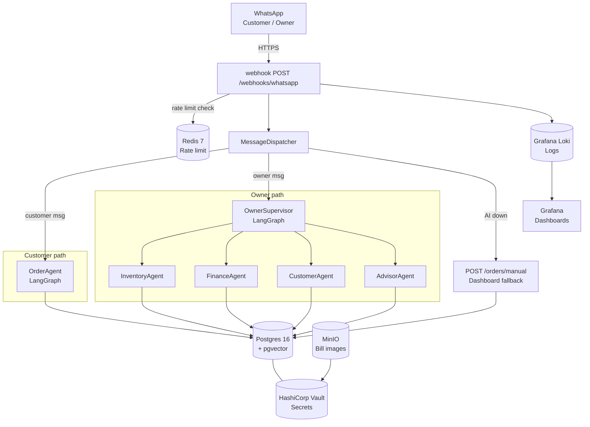

# Modir — AI Business Operations Assistant for Lebanese SMEs

Modir lets Lebanese small business owners manage orders, inventory, finance,
and customers through WhatsApp and a web dashboard, in Lebanese Arabic.
Five LangGraph AI agents handle different domains; customers place orders by
typing naturally in WhatsApp. When AI is unavailable, the owner can enter
orders manually — the business never stops.

## Architecture



## Prerequisites

- Docker 24+ and Docker Compose v2
- Git

## Quick start

```bash
git clone <repo-url> modir
cd modir
cp .env.example .env          # review and set VAULT secrets if needed
docker compose up             # starts db, redis, minio, vault, vault-seed, migrate, api, worker
```

The API is now available at `http://localhost:8000`.
The dashboard (Vite dev server) runs separately:

```bash
cd frontend
npm install
npm run dev                   # http://localhost:5173
```

## Run tests

```bash
cd backend
uv run pytest -m "not integration and not load"   # fast, offline
uv run pytest                                      # all tests (requires Postgres on localhost:5432)
```

## Observability stack (Grafana + Loki)

```bash
# Add to .env:
LOKI_URL=http://loki:3100

docker compose --profile observability up
```

Grafana is at `http://localhost:3000` (anonymous read access enabled).
The Modir dashboard loads automatically with 6 panels: request rate, error rate,
LLM fallback activations, rate-limit hits, per-tenant cost, and agent latency.

## Backup & restore

```bash
# Create a backup
docker compose --profile backup run --rm backup

# Restore from the most recent backup
docker compose --profile backup run --rm backup /app/scripts/restore.sh
```

Backups land in `backups/postgres/` (gzipped pg_dump) and `backups/minio/`
(MinIO object mirror). See [RUNBOOK.md](RUNBOOK.md) for detailed failure playbooks.

## Load test

```bash
cd backend
uv run pytest tests/load/ -m load -v
```

Requires the full Docker Compose stack running. Tests 100 concurrent requests
across 10 tenants and asserts zero cross-tenant data leakage.

## Documentation

- [RUNBOOK.md](RUNBOOK.md) — failure scenarios and recovery commands
- [DECISIONS.md](DECISIONS.md) — every architectural decision, Phase 0 → Phase 8
